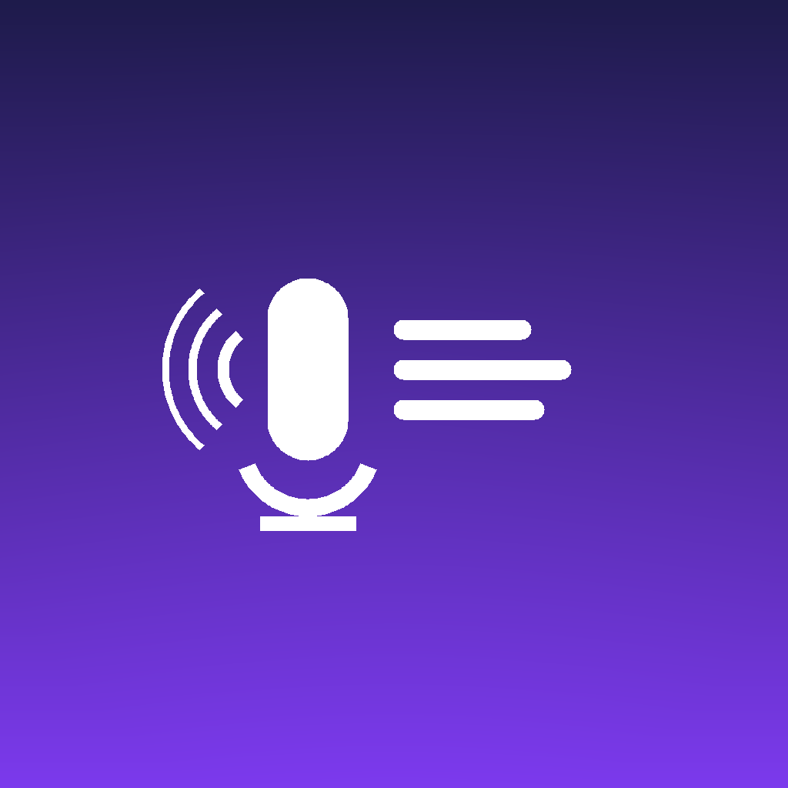

# VoiceTranscribe

<p align="center">
  
</p>

<p align="center">
  <strong>Transform voice memos into text and email them instantly</strong>
</p>

<p align="center">
  
  
  
  
</p>

---

## Overview

VoiceTranscribe is a native iOS app that converts voice recordings into accurate text transcriptions using on-device AI. Import audio files from Voice Memos or your file system, transcribe them locally using OpenAI's Whisper model, and share the results via email—all without sending your audio to external servers.

## Features

- **On-Device Transcription** — Uses OpenAI Whisper (base model) running entirely on your device via Core ML
- **Privacy First** — All processing happens locally; no audio leaves your device
- **Batch Processing** — Transcribe multiple audio files at once
- **Voice Memos Integration** — Import directly from the iOS Voice Memos app
- **Multiple Audio Formats** — Supports MP3, WAV, AIFF, M4A, and more
- **Email Export** — Compose and send transcriptions with formatted metadata
- **Clean SwiftUI Interface** — Modern, native iOS design with Dark Mode support
- **File Management** — View duration, track transcription status, and delete files

## How It Works

1. **Import Audio** — Select files from Voice Memos or use the file picker
2. **Transcribe** — Tap "Transcribe All" to process files using the on-device Whisper model
3. **Review** — View transcriptions inline or tap a file to see details
4. **Share** — Compose an email with all transcriptions formatted and ready to send

## Requirements

- iOS 16.0 or later
- Xcode 15.0 or later
- macOS 13.0+ (for development)
- ~850 MB storage for the Whisper base model

## Installation

### Clone the Repository

```bash
git clone git@github.com:gpliu3/VoiceTranscribe.git
cd VoiceTranscribe
```

### Open in Xcode

```bash
open VoiceTranscribe.xcodeproj
```

### Build and Run

1. Select your target device or simulator
2. Press `⌘R` to build and run
3. Grant microphone and file access permissions when prompted

> **Note:** The first launch may take a moment as the ML models are loaded into memory.

## Project Structure

```
VoiceTranscribe/
├── Models/
│   └── AudioFile.swift              # Data model for imported audio files
├── Views/
│   ├── ContentView.swift            # Main app interface
│   ├── AudioFileRow.swift           # List item for each audio file
│   └── EmailComposerView.swift      # Email composition sheet
├── Services/
│   ├── AudioFileManager.swift       # Handles file imports and storage
│   └── TranscriptionService.swift   # Manages Whisper ML model and transcription
└── Resources/
    └── Models/
        └── openai_whisper-base/     # Core ML compiled Whisper model
```

## Technical Details

### AI Model

- **Model:** OpenAI Whisper (base variant)
- **Framework:** Core ML (Apple Silicon optimized)
- **Processing:** On-device inference
- **Languages:** Multilingual support (96 languages)
- **Accuracy:** ~85-90% WER (Word Error Rate) for English

### Architecture

- **UI Framework:** SwiftUI
- **Data Flow:** MVVM pattern
- **File Storage:** Document directory with security-scoped bookmarks
- **Concurrency:** Async/await for transcription tasks

### Key Dependencies

- **WhisperKit** (via Swift Package Manager) — Whisper integration for iOS
- Core ML
- AVFoundation
- MessageUI

## Usage Tips

- **Best Audio Quality:** Use recordings with minimal background noise for optimal transcription accuracy
- **Batch Limits:** Processing many large files simultaneously may impact performance on older devices
- **Storage:** The app stores imported audio files locally; clear old files periodically to save space

## Roadmap

- [ ] Real-time transcription during recording
- [ ] Export to multiple formats (TXT, JSON, Markdown)
- [ ] Speaker diarization (identify multiple speakers)
- [ ] Custom vocabulary and domain-specific models
- [ ] iCloud sync for transcriptions
- [ ] Apple Watch companion app

## Contributing

Contributions are welcome! Feel free to:

- Report bugs via [GitHub Issues](https://github.com/gpliu3/VoiceTranscribe/issues)
- Submit feature requests
- Open pull requests with improvements

## License

This project is licensed under the MIT License. See [LICENSE](LICENSE) for details.

## Acknowledgments

- **OpenAI Whisper** — Speech recognition model
- **Argmax AI** — WhisperKit Swift integration
- Icon design — Generated with custom Python/PIL script

---

<p align="center">
  Made with ❤️ by <a href="https://github.com/gpliu3">gpliu3</a>
</p>
